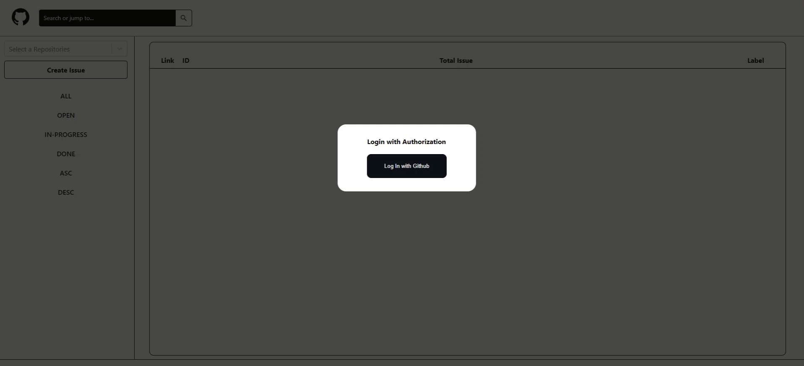
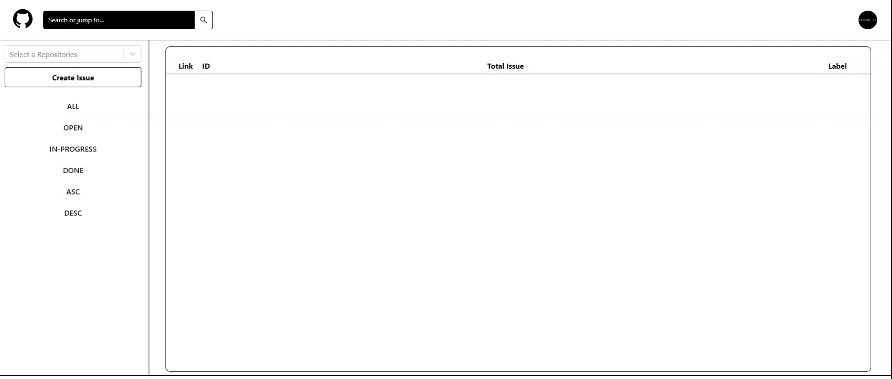
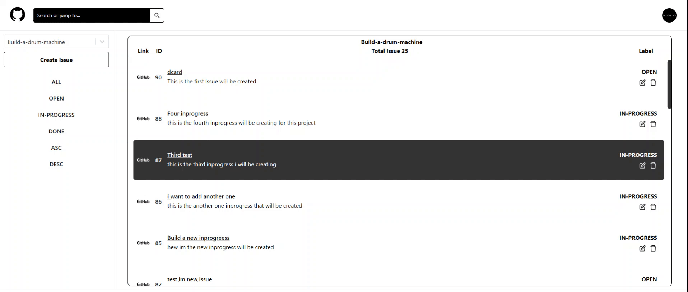
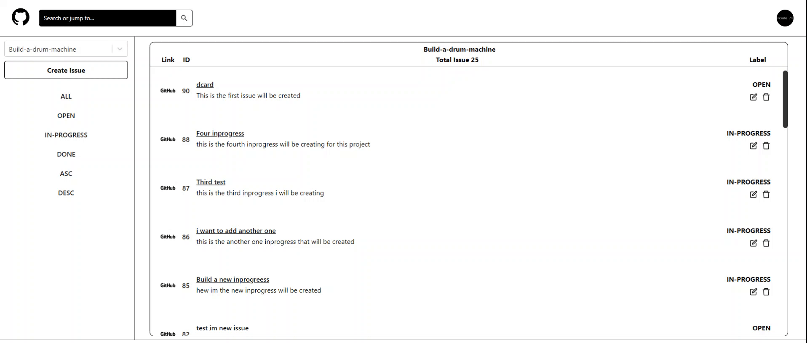

# Github Explorer

View the website [here](https://github-explorer-chandrahong.vercel.app/home)

This project is a Github-Issue web-app. 

There are some features such as :
- Create , Search, Update, Delete Issue.
- Look into your profile and repositories.

## Tools and Programming Languages

#### Client : 

Javascript, CSS, React, Redux, Boostrap, Github API.

#### Server :

Express

#### Deployment :

Vercel

## Running project on Local

1. Clone the project https://github.com/chandrahong/Github-Explorer.git
2. In server folder add new .env file . This file should include your client_id, and client_secret

- CLIENT_ID= 

- CLIENT_SECRET= 

3. Run in command prompt / terminal 

- cd server

- npm start / yarn start

4. Open another command prompt / terminal

- cd client

- npm start / yarn start

## Website Page

### Login into website

Login to the github using your account.

### Select a repositories

Need to select a repositories, can either type the name or select the repositories.

### Implementing infinite-scroll

The left sidebar have 6 different filter section which is ALL, OPEN, INPROGRESS, DONE, ASCENDING, DESCENDING. 

Implemented infinite-scroll to call 10 issue everytime until the last issue.

### Create Issue

Create Modal with Title as Required , Body with minimum-length 30 words.

### Search Issue

Find the issue by searching the title of issue.

### Update , Delete Issue and Logout

1. Edit issue by title, label, body.
2. Delete issue by the issue number.
3. Go to user github profile.
4. Go to user repositories
5. Sign out to the LOGIN page.
